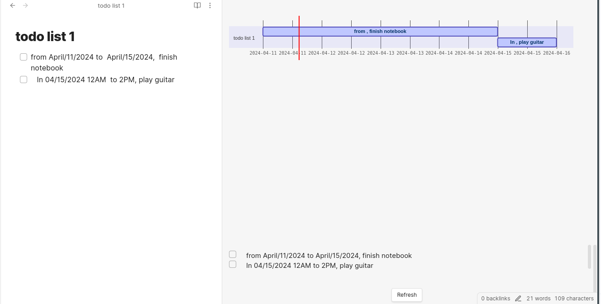
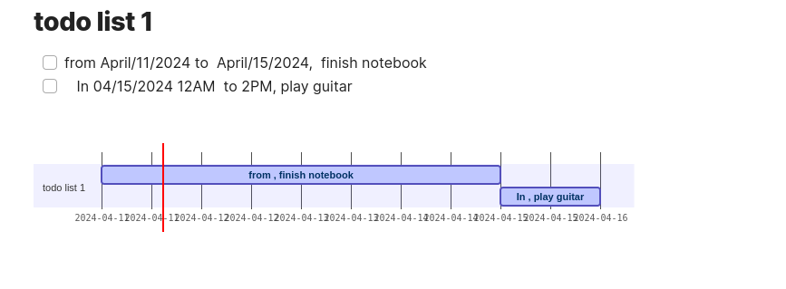

<h1
    align="center"
>Obsidian Smart Gantt</h1>

<div align="center">
<sub>Intelligently generate Gantt Chart for your task across your vault</sub>

</div>

<ul>

- Keep track of all your tasks across your vault.
- Generate a Gantt chart based on them
- Quick jump to your task location. 

</ul>

##### Simplest use cases

###### Using the right sidebar.

- Open your sidebar and magic will happen



###### Gantt code block.


<div><sub>Simply create a Gantt code block somewhere in your file </sub> </div>

````markdown
 ```gantt

 ```
````




##### Limitation


> [!tip]
> 
> Only track a task (line with checkbox) with part of string that can interpret as a time
> 
> Smart Gantt is not perfect for natural language processing:
> - Cannot parse text with only year like "2024"
> - Time (hours, minutes) of day must stay after date. Example Sat Aug 17 2024 9 AM or Sat Aug 17 2013 18:40:39 GMT+0900 or 2014-11-30T08:15:30-05:30
> - Relative time like today, tomorrow, yesterday, last friday, 5 hours from now work, but it is not useful at all. At least in the early version
