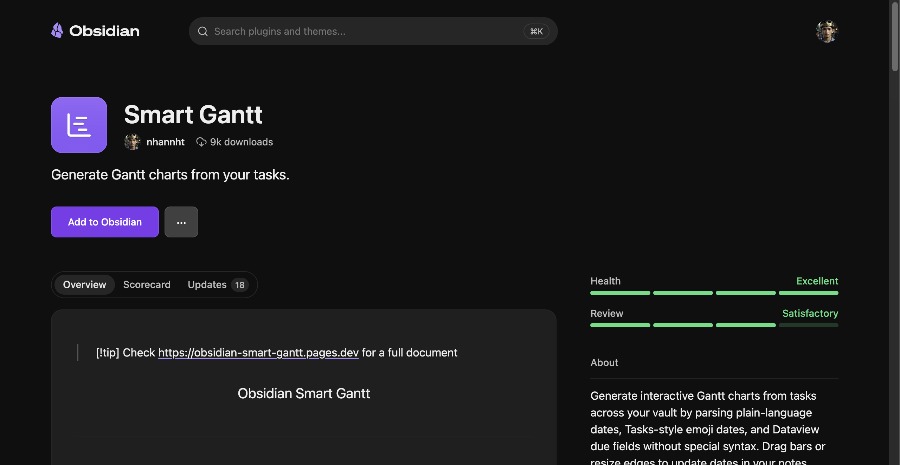
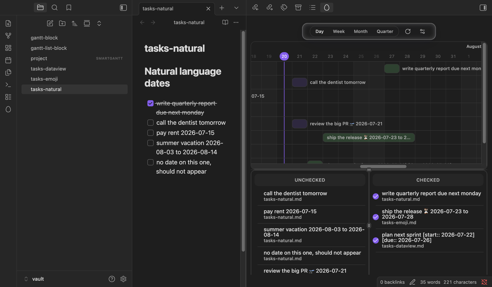
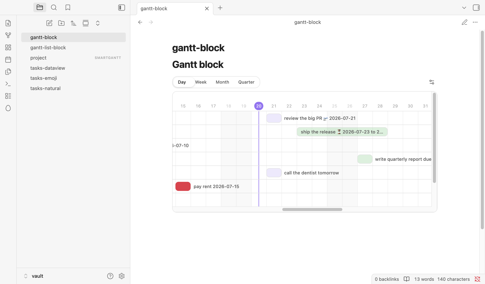

<h1 align="center">Smart Gantt</h1>

<div align="center">
<sub>Turn the tasks scattered across your vault into an interactive Gantt chart.</sub>
</div>

<br/>

<div align="center">

[](https://community.obsidian.md/plugins/smart-gantt)
[](https://github.com/nhannht/obsidian-smart-gantt/releases/latest)
[](./LICENSE)

**[Website](https://smartgantt.nhannht.io.vn)** | **[Community store](https://community.obsidian.md/plugins/smart-gantt)** | **[Changelog](./CHANGELOG.md)**

</div>

---

## Install

Smart Gantt is live on the Obsidian community plugin store.

- In Obsidian: **Settings -> Community plugins -> Browse**, search for **Smart Gantt**, install and enable.
- Or one click from your browser: [Add to Obsidian](https://obsidian.md/plugins?id=smart-gantt).

[](https://community.obsidian.md/plugins/smart-gantt)

## What it does

- Tracks every task across your vault - no plugin-specific syntax to learn.
- Understands dates written in plain language ("due next monday", "tomorrow"), Tasks-style emoji dates, and Dataview `[due:: ]` fields.
- Renders them as an interactive Gantt chart: drag a bar to reschedule and the date is rewritten in your note, resize edges to change start/end, zoom Day/Week/Month/Quarter.
- Click any bar to jump straight to the task in its note.
- Works on desktop and mobile.

## Use it two ways

### The sidebar view

Open the Smart Gantt view from the right sidebar and every dated task in your vault shows up on one timeline.



### A gantt code block

Drop a `gantt` code block anywhere in a note to embed a chart scoped to that document:

````markdown
```gantt

```
````



Right click (hold on mobile) the chart to open the settings view. Settings are stored as JSON inside the code block, so you can also edit them by hand.

## Limitations

Smart Gantt tracks lines with a checkbox that contain something interpretable as a time or time range. Its natural language parsing is good, not psychic:

- A bare year like "2024" is not enough context - write the date a bit more clearly.
- Time of day must come after the date: `Sat Aug 17 2024 9 AM` works; `9 AM Aug 17 2024` parses as two separate points in time.
- Relative phrases ("today", "tomorrow", "last friday") technically work but re-anchor to the current moment every refresh, which is rarely what you want.

## License

[MIT](./LICENSE)
